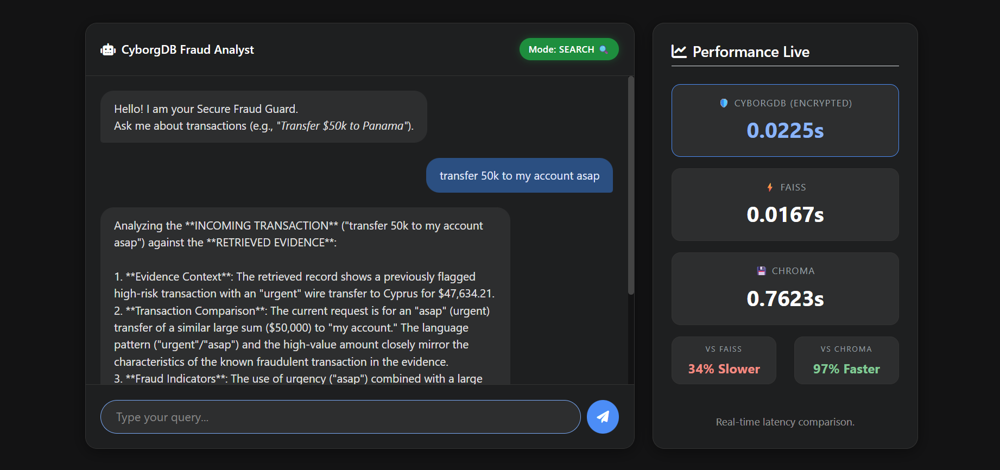
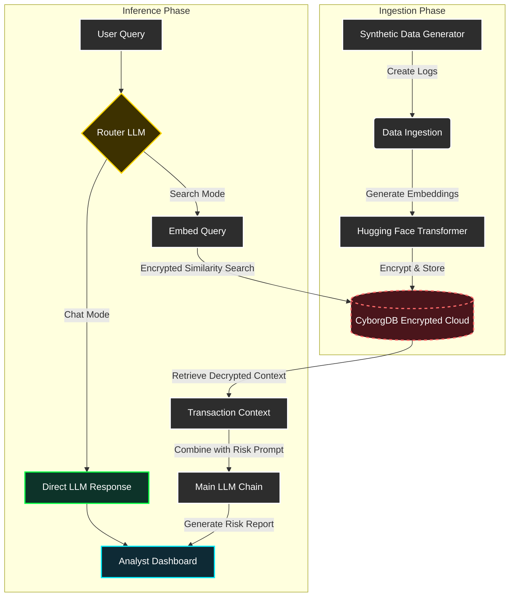
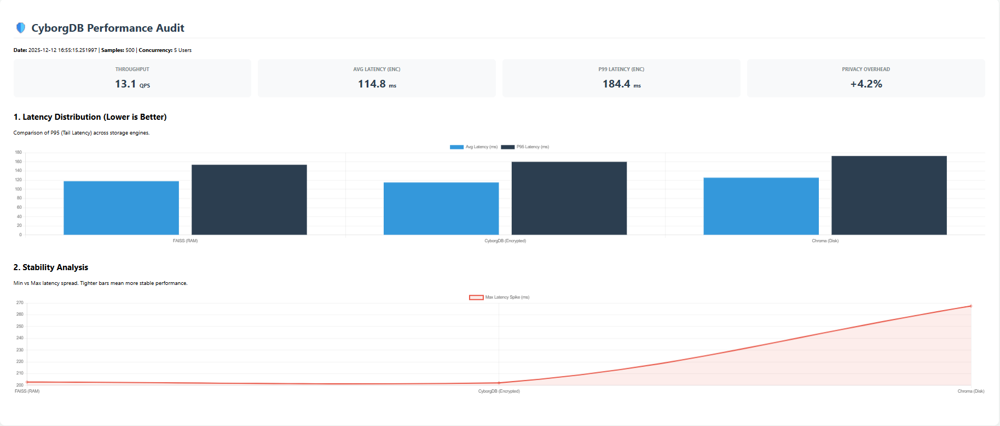

# 🛡️ Finguard: Secure Fraud Detection RAG

**Privacy-First Financial Forensics Powered by CyborgDB**

[](https://www.python.org/)
[](https://www.cyborg.co/)
[](https://www.langchain.com/)
[](https://en.wikipedia.org/wiki/Advanced_Encryption_Standard)
[](LICENSE)

> **fraud_detection** is a secure **Retrieval-Augmented Generation (RAG)** pipeline designed to detect anomalies and flag potential fraud in sensitive financial documents.
>
> Financial data demands absolute privacy. Unlike standard RAG implementations, it leverages **CyborgDB** to ensure that all transaction embeddings are **encrypted at rest and in transit**. We enable AI-driven insights without ever exposing raw financial vectors to plain-text vulnerabilities.

---

## 📸 Demo & Dashboard

### 📉 Fraud Analysis Dashboard


*Real-time analysis of transaction logs with risk scoring, powered by secure RAG retrieval.*

### 🎥 Watch the System in Action

[](https://www.youtube.com/watch?v=OIHUFWAG0HI)
*Click the thumbnail above to see the Encrypted Fraud Detection pipeline flow.*

---

## 🔒 The Encrypted Architecture (ML Flow)

We utilize **CyborgDB** to maintain a "Zero-Trust" architecture for vector storage.



---

## 📊 Security & Performance Benchmarks

In financial contexts, speed matters, but security is non-negotiable. We benchmarked the impact of CyborgDB's encryption on retrieval latency.  
Click here to view the full interactive `benchmark.html` report.




---

## 🚀 Key Features

* **CyborgDB Integration**: Industry-first encrypted vector search. Even if the database is compromised, the vectors remain unreadable.
* **Context-Aware Forensics**: Queries like `"Show me transactions over $10k sent to offshore accounts"` retrieve exact matches from the encrypted index.
* **Hybrid Analysis**: Combines semantic search (RAG) with rule-based filtering for maximum fraud detection coverage.
* **Persistent Secure Indexing**: Ingest terabytes of logs once; query securely forever.
* **Synthetic Data Genration**:Gerates Synthetic data using Faker library.

---

## 🛠️ Tech Stack

**Component — Technologies**

* Vector Database — CyborgDB (Encrypted Storage)
* Orchestration — LangChain, Python
* Embeddings — Hugging Face (sentence-transformers/all-MiniLM-L6-v2)
* Web Interface —  Flask 
* Data Processing — Pandas, NumPy

---

## 🏗️ Deployment & Setup

### Prerequisites

* Python 3.11
* CyborgDB API Key (Required for encrypted storage)
* Git

### 1. Clone the Repository

```bash
git clone https://github.com/Nossks/fraud_detection.git
cd fraud_detection
```

### 2. Set up Virtual Environment

```bash
python -m venv venv
# Linux/Mac:
source venv/bin/activate
# Windows:
.\venv\Scripts\Activate
```

### 3. Install Dependencies

```bash
pip install -r requirements.txt
```

### 4. Configure Environment Variables

Create a `.env` file. You must provide CyborgDB credentials to enable the encrypted layer.

```env
# CyborgDB Config (Crucial)
CYBORGDB_API_KEY=your_cyborg_api_key
CYBORGDB_URL=your_cyborg_instance_url

# AI Models
HUGGINGFACEHUB_API_TOKEN=hf_your_token_here
GOOGLE_API_KEY=api-key
```

### 5. Run the Application

Run the Prediction Pipeline :

```bash
python prediction.py
```

Launch the Dashboard:

```bash
python app.py
```

---

## 📂 Project Structure

```
fraud_detection/
├── app.py                  # Application entry point
├── src/                    # Core logic (pipelines, components, utils)
├── data/                   # Datasets and vector stores
├── notebooks/              # Experiments and prototyping
├── static/ & templates/    # Frontend assets
├── logs/                   # Runtime logs
├── requirements.txt
└── README.md

```

---

## 🔮 Future Scope

* [ ] Real-time Stream Processing: Hooking into Kafka for live transaction monitoring.
* [ ] Graph RAG: Using Knowledge Graphs to detect syndicate fraud rings.
* [ ] Multi-Modal Support: Scanning scanned checks and invoices (OCR).

---

## 🤝 Contributing

Contributions are welcome! Please fork the repository and create a pull request.

---

## 📄 License

This project is licensed under the MIT License.

---
